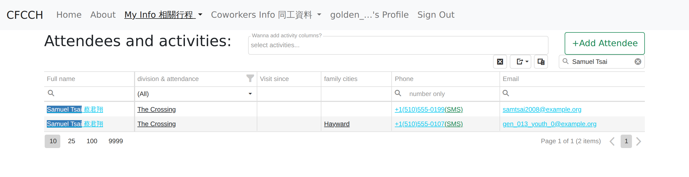
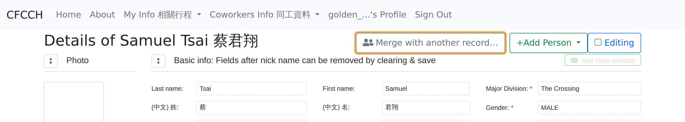
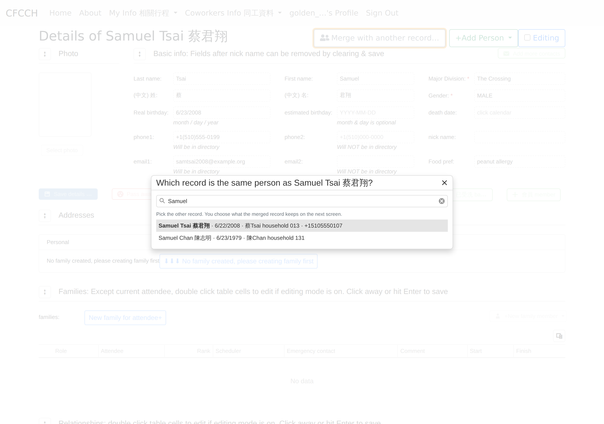
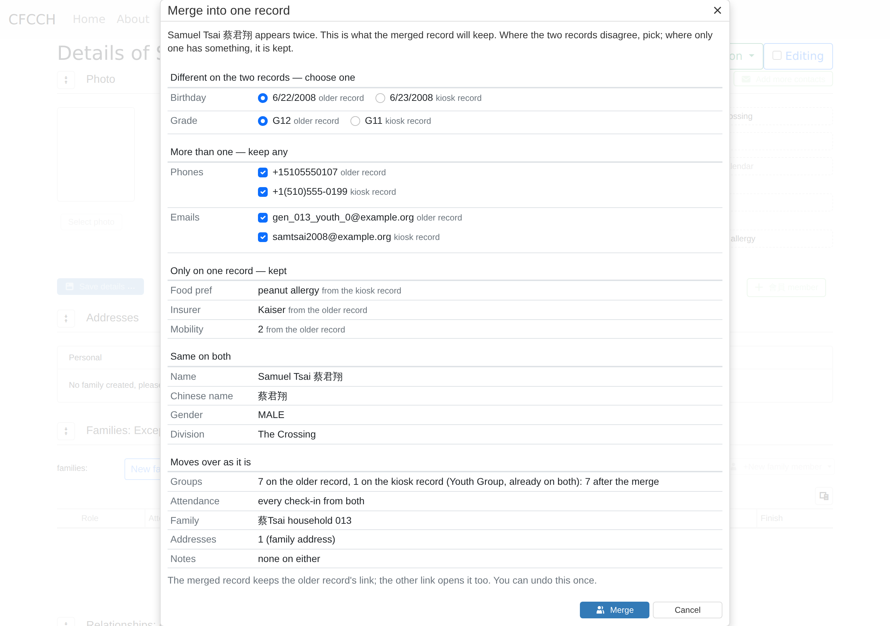
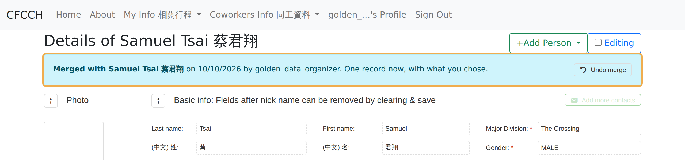
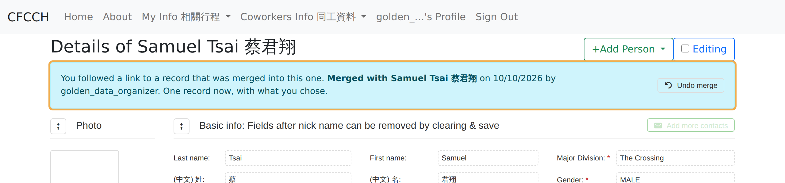
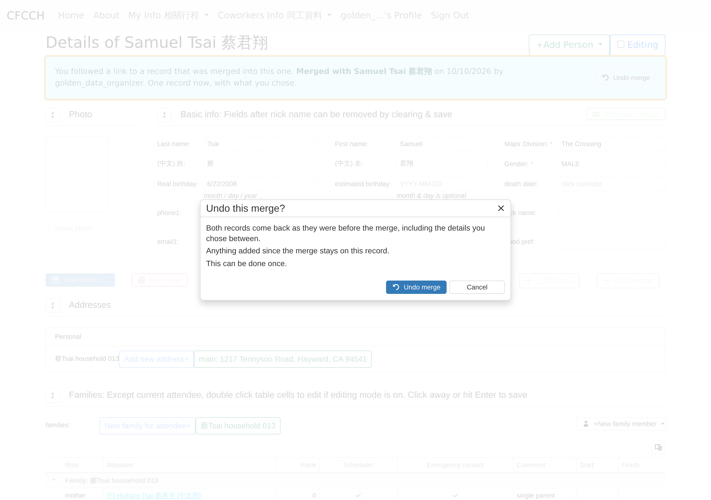
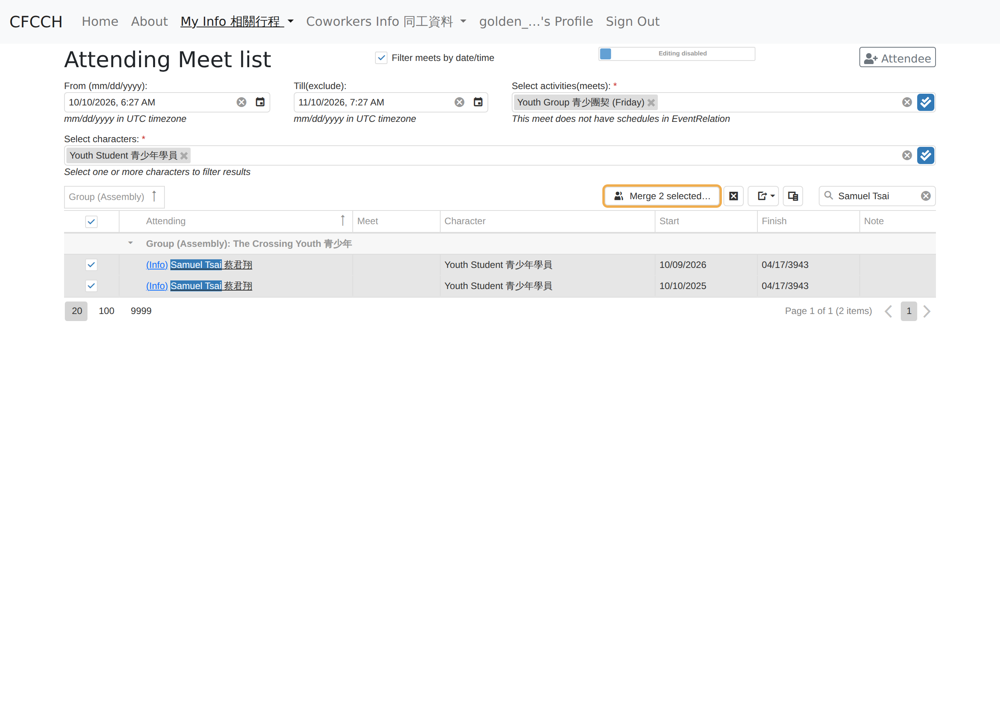
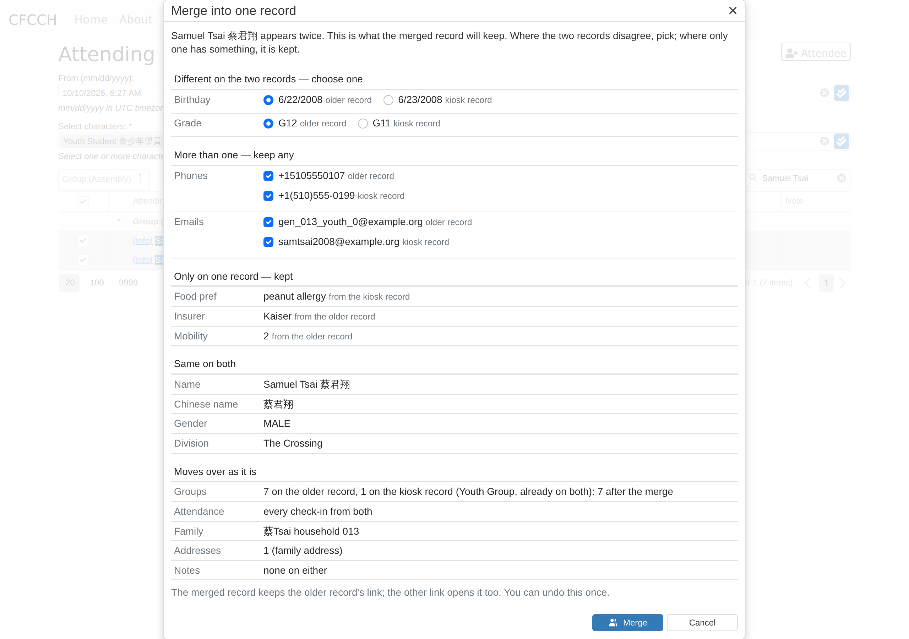

# Merging two records

What a coworker sees when two attendee records turn out to be one person, drawn on the real attendees32 pages with the golden test data. The amber outline marks what is new.

One rule throughout: **you are shown what the merged record will look like, and you decide it before anything changes.** There is no primary and no secondary record.

## From the person's page

The place a duplicate is usually noticed: somebody opens a record and realises the person already exists.

### 1. Today: two records for one person

Samuel Tsai was added twice. The kiosk made a new row with a different phone number and a birthday one day off; the older row is the one already in the Tsai household.

### 2. Open either record and choose Merge

The action sits with the page's other actions, next to Add Person and Editing. It shows only for the groups that may edit attendees. It does not matter which of the two records you start from.

### 3. Say which record is the same person

Type a name. Each match shows birthday, family and phone, so the right one is easy to tell apart from a namesake. Picking a record here decides nothing yet; the next screen does.

### 4. Decide what the merged record keeps

One screen shows the merged record before it exists, field by field, in five groups:

- **Different on the two records: choose one.** Birthday and grade disagree, so each shows both values with a radio. The older record's value is preselected; one click swaps it.
- **More than one: keep any.** Phones and emails can hold several values, so both records' values are listed with a checkbox each, all ticked. Untick what is wrong or stale.
- **Only on one record: kept.** The peanut allergy from the kiosk record and the insurer from the older record are kept as they are, and the screen says which record each came from.
- **Same on both.** Name, gender, division. Listed so you can see the two really are one person.
- **Moves over as it is.** Groups, attendance, family, addresses, notes. Counted, never chosen.

One sentence at the bottom says that the merged record keeps the older record's link, that the other link opens it too, and that the merge can be undone once.

### 5. Afterwards, one record says so

The page shows the merged record with the details you chose. A notice under the title says who was merged in, when and by whom, with Undo merge right there.

Anyone opening the other record's link lands here too, with one extra sentence.

### 6. Undo, once

Undo puts both records back as they were before the merge, including the details you chose between. Anything added since the merge stays on this record.

## From the enrollment grid

The other place twins show up: a group's enrollment list, where a kiosk-made record sits right under the real one.

### 7. Tick two rows

On the Attending Meet list for the youth group, search the name and tick both rows. Merge 2 selected appears only when exactly two rows are ticked.

### 8. The same screen

The same merge screen with the same words and the same groups. Since you ticked both rows, there is no picker step; it goes straight to deciding what the merged record keeps.

## What stays simple

- No primary and no secondary. You see the merged record before it exists and decide it, field by field.
- Only real differences ask a question. Same values, values on one record only, and everything that moves over are shown, not asked.
- Everything else moves: groups, attendance, family, notes, addresses.
- The merged record keeps the older record's link. The other link keeps working because it opens the merged record.
- Undo once, from the merged record's page. Both records come back as they were, chosen details included.
- One screen, used from the page and from the grid.

Screens captured from attendees32 running the golden test data at 1280 pixels wide, with the new controls drawn into the live pages. The second Samuel Tsai was added for this walkthrough.
